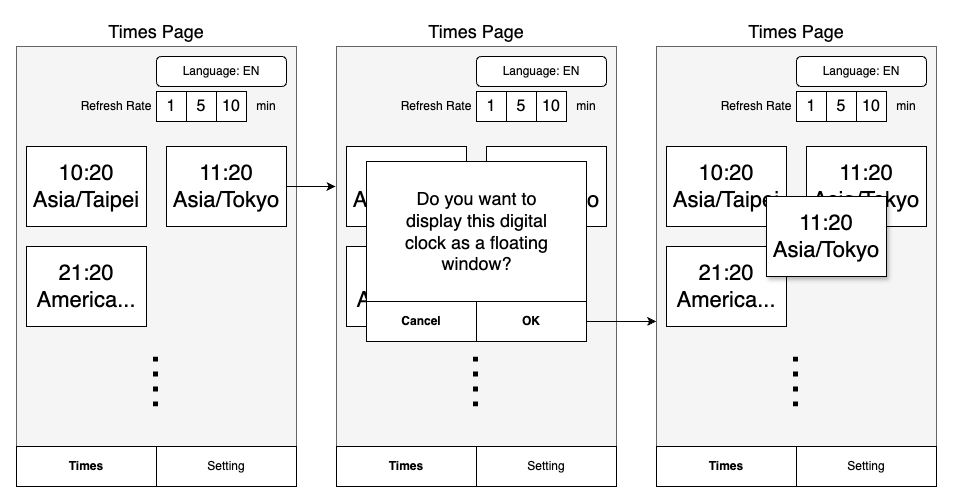

ViewSonic
===

-blue)

## Contents

[TOC]

## Requirement

1. Environment and Technology Stack
    - Languages & Frameworks: Kotlin, Coroutine, Flow
    - Minimum SDK: Android 9.0
    - Target SDK: Android 15
2. Allows interface language switching without requiring an app restart
    - Support for two languages: English and Mandarin Chinese.
3. The digital clock should update in real-time, following the refresh rate set by the user.
4. The app should have two main pages: the Times Page and the Settings Page, which can be navigated by using the BottomNavigation.
5. Functionality of pages:
    - Times
        
        - There should be a button that displays the language-switching dialog when clicked.
        - There should be radio buttons to adjust the refresh rate for digital clocks.
        - Display the time for different countries in a two-column scrollable grid layout
        - If the list has not been retrieved and no digital clocks are available, show “No data” atthe center of the screen.
        - Users can click on any digital clock to display it as a floating window that overlays other apps and can be dragged.
         

        Bonus :
        Try to keep the floating digital clock window alive even after the user removes your Android app from the recent apps list.
        - Implement any business logic you find appropriate based on the UI wireframe.
    - Setting
        

        - The list data should be retrieved from the APIs listed in the following resources.
        - The list should be stored in and loaded from a local database.
        - The list should be ordered by creation time in descending order.
        - The list should be modifiable, supporting add, edit, and remove functions.
        - The list should be vertically scrollable.
        - Implement any business logic you find appropriate based on the UI wireframe.

## Requirement

1. API : https://timeapi.io/swagger/index.html
2. String : If additional strings are needed, please add them as necessary.